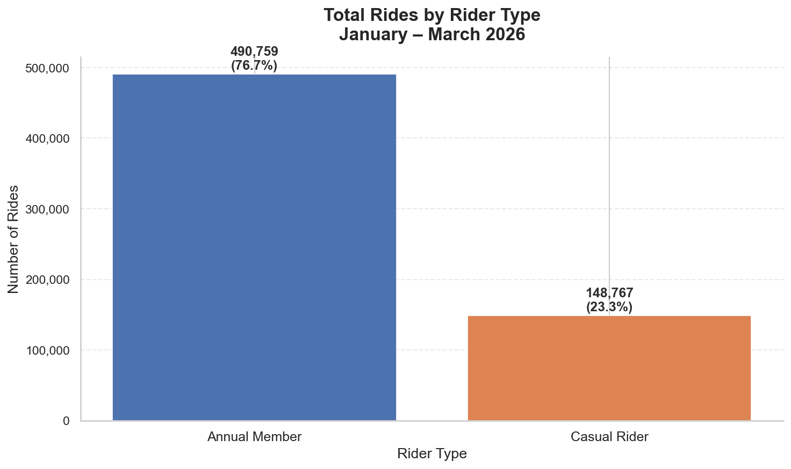
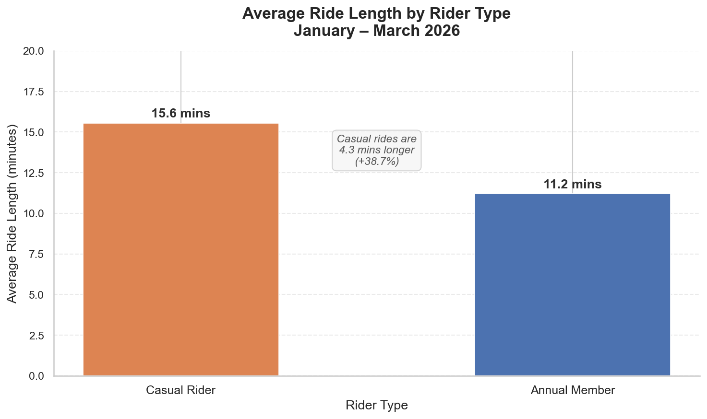
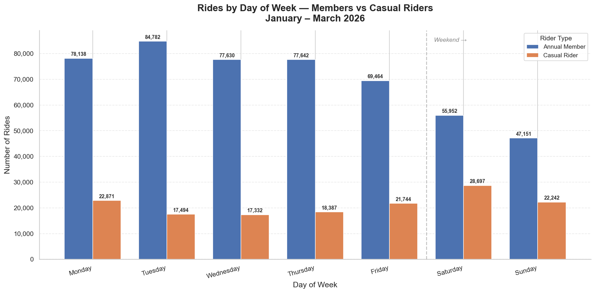
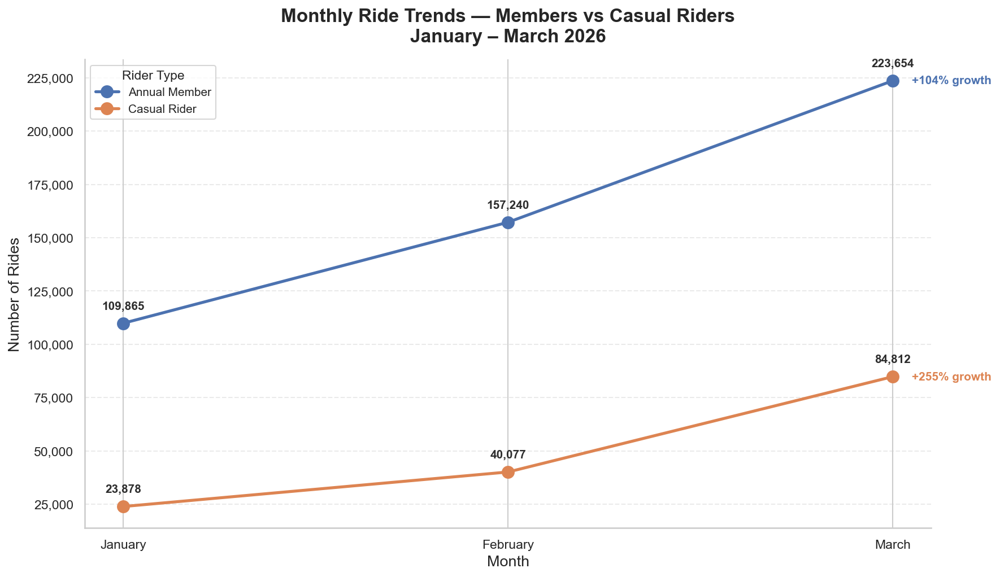
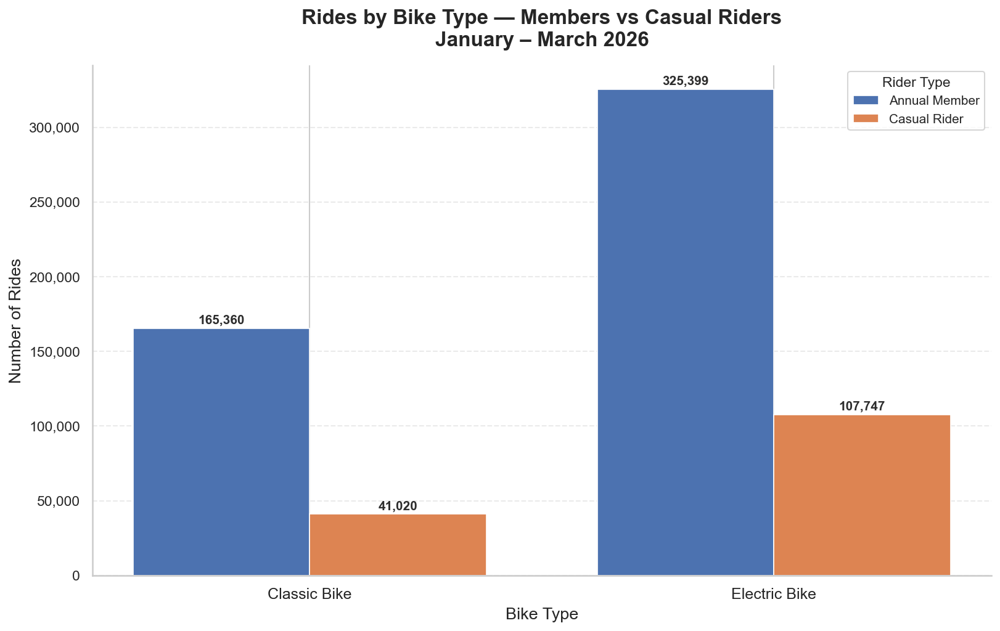
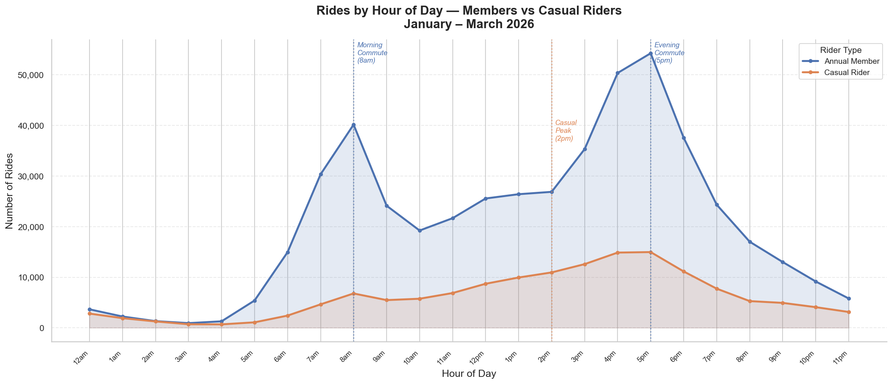

# 🚲 Cyclistic Bike-Share Analysis
### How do annual members and casual riders use Cyclistic bikes differently?


---

## 📌 Quick Links

| Resource | Link |
|---|---|
| 📊 Tableau Dashboard | [View Live Dashboard](https://public.tableau.com/views/CyclisticBike-ShareAnalysisJan-Mar2026SavioKennethMyers/Overview?:language=en-US&:sid=&:redirect=auth&:display_count=n&:origin=viz_share_link) |
| 📄 Full PDF Report | [Download Report](https://drive.google.com/file/d/1ygyad4_BM6hzkNRrGwIKe_2wicqTqYgz/view?usp=sharing) |
| 💾 Clean Dataset | [Download CSV](https://drive.google.com/file/d/1XeKoFtS50-5cNf_yR19J_kpjNM3J_LTN/view?usp=sharing) |
| 📓 Jupyter Notebook | [View Analysis](Analysis/cyclistic_analysis.ipynb) |
| 🗃️ Raw Data Source | [Divvy Trip Data](https://divvy-tripdata.s3.amazonaws.com/index.html) |

---

## 📖 Project Overview

This is a capstone project completed as part of the **Google Data Analytics Professional Certificate**. The business scenario is fictional, designed to simulate a real-world marketing analytics problem. The underlying trip data is genuine, sourced from Motivate International Inc.'s publicly available Divvy bike-share dataset for Chicago, used in accordance with their Data Licence Agreement.

### Business Context
Cyclistic is a fictional bike-share company in Chicago with a fleet of 5,800+ bicycles across 600+ docking stations. The company's finance team has established that annual members generate considerably more revenue than casual riders. The director of marketing believes the most efficient growth strategy is converting existing casual riders into annual members.

### Business Task
> *Analyse Cyclistic trip data to identify the behavioural differences between casual riders and annual members, and use those findings to recommend marketing strategies that will convert casual riders into annual memberships.*

---

## 📊 Key Findings

| # | Finding | Insight |
|---|---|---|
| 1 | **Rider split** | Members take 76.7% of rides. Casual riders take 23.3% — nearly 150,000 trips in winter alone |
| 2 | **Ride duration** | Casual riders average 15.6 mins vs 11.2 mins for members — 38.7% longer |
| 3 | **Day of week** | Members peak on Tuesdays. Casual riders peak on Saturdays — completely opposite |
| 4 | **Monthly growth** | Casual ridership grew 255% Jan to Mar vs 104% for members |
| 5 | **Bike type** | 72.4% of casual rides use electric bikes vs 66.3% for members |
| 6 | **Peak hours** | Members show double commute peak at 8am and 5pm. Casuals peak at 2pm |
| 7 | **Top stations** | Navy Pier is the only top-10 station where casuals outnumber members |
| 8 | **Weekend rides** | Casual riders take longest rides on Saturdays (18.2 mins avg) |

---

## 🎯 Top 3 Recommendations

**1. Launch a spring weekend membership drive**
Casual ridership grew 255% from January to March and peaks on Saturdays. A targeted campaign running from March through June at stations like Navy Pier would reach casual riders at their most active.

**2. Build the membership pitch around ride length**
Casual riders average 15.6 mins per trip. A personalised in-app message after each ride showing how much they would have saved with a membership is a credible and direct conversion argument.

**3. Introduce a premium electric bike membership tier**
72.4% of casual rides use electric bikes. A premium tier with guaranteed e-bike access or reduced unlock fees directly targets what casual riders already value most.

---

## 🛠️ Tools and Technologies

| Tool | Purpose |
|---|---|
| **Excel / WPS Sheets** | Initial data exploration and pivot table analysis |
| **Python (Pandas)** | Data combining, cleaning and transformation |
| **Matplotlib & Seaborn** | Data visualisation — 6 professional charts |
| **SQL (SQLite3)** | 8 structured queries for targeted analysis |
| **Tableau Public** | 2 interactive dashboard pages |

---

## 📁 Repository Structure

```
cyclistic-bike-share-analysis/
│
├── 📓 Analysis/
│   └── cyclistic_analysis.ipynb     # Full Jupyter notebook with all code
│
├── 🖼️ Visualizations/
│   ├── 01_rides_by_rider_type.png
│   ├── 02_avg_ride_length.png
│   ├── 03_rides_by_day.png
│   ├── 04_monthly_trends.png
│   ├── 05_rides_by_bike_type.png
│   └── 06_peak_hours.png
│
├── 📄 Report/
│   ├── Cyclistic_Analysis_Report_Savio_Kenneth_Myers.pdf
│   └── Cyclistic_Analysis_Report_Savio_Kenneth_Myers.docx
│
├── .gitignore                        # Excludes large CSV file
└── README.md                         # This file
```

> **Note:** The clean dataset (639,526 rows, 141MB) exceeds GitHub's file size limit.
> Download it directly: [Google Drive Link](https://drive.google.com/file/d/1XeKoFtS50-5cNf_yR19J_kpjNM3J_LTN/view?usp=sharing)

---

## 📈 Visualizations

### Rides by Rider Type


### Average Ride Length


### Rides by Day of Week


### Monthly Ride Trends


### Rides by Bike Type


### Peak Hours by Rider Type


---

## 🔄 Analysis Process

This project followed the **6-phase Google Data Analytics framework:**

```
ASK → PREPARE → PROCESS → ANALYZE → SHARE → ACT
```

### Phase 1 — Ask
Defined business task and identified key stakeholders.

### Phase 2 — Prepare
Downloaded 3 months of Divvy trip data (Jan–Mar 2026). Assessed credibility using ROCCC framework. Confirmed public licence for use.

### Phase 3 — Process
Combined 3 CSV files (656,274 rows) into single dataset using Python. Applied 9 cleaning steps. Removed 16,728 invalid records. Final clean dataset: 639,526 rides.

**Cleaning steps:**
- Removed duplicate ride IDs (0 found)
- Converted timestamps to datetime format
- Calculated ride_length_mins column
- Removed rides under 1 minute (16,154 false starts)
- Removed rides over 24 hours (574 anomalies)
- Extracted day_of_week, month, hour, date columns
- Standardised text column values
- Removed 20 December outlier rows

### Phase 4 — Analyse
Ran 8 SQL queries using SQLite3. Built pivot tables in Excel. Identified 8 key behavioural differences between rider types.

### Phase 5 — Share
Created 6 Python visualisations. Built 2-page interactive Tableau dashboard. Produced full PDF and Word report.

### Phase 6 — Act
Delivered 3 data-backed strategic recommendations for the Cyclistic marketing team.

---

## ⚠️ Limitations

- **Seasonal bias:** Analysis covers winter months (Jan–Mar 2026) only. Casual ridership is naturally lower in winter. Summer patterns not captured.
- **Privacy constraints:** Individual riders cannot be tracked across trips due to data privacy rules.
- **Tourist vs resident:** Cannot determine whether casual riders are Chicago tourists or residents.

---

## 📋 Dataset Details

| Detail | Value |
|---|---|
| Source | Motivate International Inc. (Divvy bike-share) |
| Period | January through March 2026 |
| Raw records | 656,274 rides |
| Clean records | 639,546 rides |
| Columns | 13 original + 5 engineered |
| Licence | [Motivate Data Licence Agreement](https://www.divvybikes.com/data-license-agreement) |

---

## 👤 About the Analyst

**Savio Kenneth Myers**
Junior Data Analyst | Google Data Analytics Certificate

[](https://www.linkedin.com/in/savio-kenneth-myers-a9a530223/?skipRedirect=true)
[](https://public.tableau.com/app/profile/savio.kenneth.myers/vizzes)

---

## 📜 Licence

This project is for educational and portfolio purposes. Data used under [Motivate International Inc. Data Licence Agreement](https://www.divvybikes.com/data-license-agreement).

---

*Completed: April 2026 | Google Data Analytics Professional Certificate Capstone*
